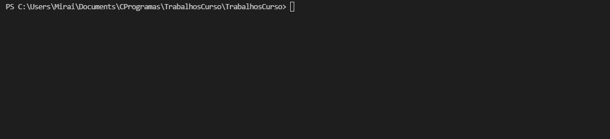
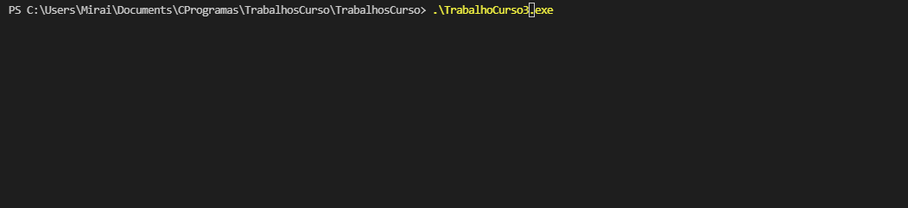
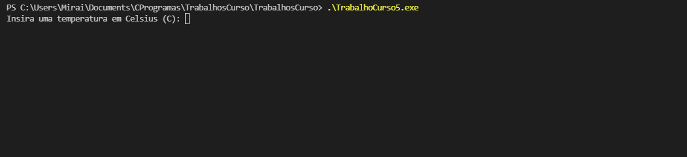

<h1 align="center">🐱‍💻 ⟩ TrabalhosCurso ⟨ 🐱‍💻 </h1> 
 

Alguns trabalhos para meu curso de Lógica de Programação, alguns deles eu não consegui/não entendi, mas sinto que grande maioria está correto. Este é apenas um projeto de iniciante, então não espere muita coisa.  

Um salve para o professor [Gabriel Librande](https://github.com/Gabiru-cpu) e meus manos [Ricardo](https://github.com/Ribruno), Alan e Gabriel²!

 

 ## 👾 ⟩ TrabalhoCurso1.c
 - [x] "Com printf peça para o usuário enviar um número e apenas permitir que o primeiro número seja maior que o próximo número, caso seja maior reinicie o processo, após isso peça para enviar o próximo número e diga o envie o intervalo."

  
 ## 👾 ⟩ TrabalhoCurso2.c
 - [ ] Receber um valor qualquer do teclado e imprimir esse valor, dps envie a % que voce quer desse numero
e depois printar o numero enviado, porcentagem que o usuario deseja, resultado dessa porcentagem e o reajuste.

(Não tenho certeza se isso está certo, então.....)

  
 ## 👾 ⟩ TrabalhoCurso3.c
 - [x] Informar um preço de um produto e calcular novo preço com desconto de 9%.

(Bom, o Google diz que 9% de 50 é 45, então, acho que está certo--)

  
 ## 👾 ⟩ TrabalhoCurso4.c
 - [ ] Cálculo de um salário líquido de um professor. Serão fornecidos valor da hora aula, número de aulas dadas e o % de desconto do INSS.

(Esse...foi o mais próximo que entendi.)

  
 ## 👾 ⟩ TrabalhoCurso5.c
 - [x] Ler uma temperatura em graus Celsius e transformá-la em graus Fahrenheit.

